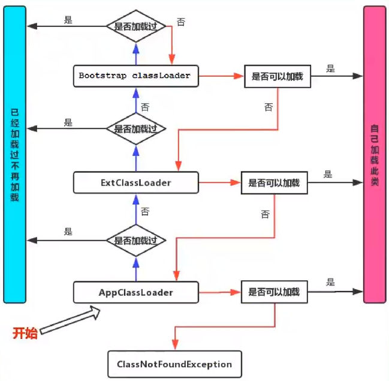

# 1 android UI适配屏幕 px
[适配]: [https://www.jianshu.com/p/55e0fca23b4f](适配)
## 1 dpi 计算
- 普通手机:1920x1080??: (1920^2 + 1080^2)^(1/2) / 5英寸 =  2203 / 5 = 440dpi    分辨率   1080/(440/160) = 372.7dp 实际:411
- 小米10 2340x1080 (2340^2 + 1080^2)^(1/2) / 6.67英寸 = 2577 / 6.67 = 386dpi    分辨率 1080/(386/160) = 447.7dp  实际:392
- ????density??, ?????dp???. ???view??dp???????????????; 

- 怎样获取android dpi = Context.getResource().getDisplayMetrics()

# 2 AB两个Activity生命周期
start A -> start B -> backpressed
- | A: onCreate
- | A: onStart
- | A: onResume
- |
- | A: onPause
- | B: onCreate
- | B: onStart
- | B: onResume
- | A: onStop
- |
- | B: onPause
- | A: onRestart
- | A: onStart
- | A: onResume
- | B: onStop
- | B: onDestroy

A 是窗体的话 打开B时不会stop,  注意Activit的四个lunchMode: stander; singleTop; singleTask; singleInstance

# 3 startActivity 子线程是否有问题?
| 没有问题. 

# 4 Handler 机制

```
    //经常见到有这样的失败
	void checkThread() throw new CalledFromWrongThreadException(
			 "Only the original thread that created a view hierarchy can touch its views");
```

```
    -> msg new Message()/Handler.obtainMessage()/Handler.obtain(); 创建一个消息msg
    -> Handler.sendMessage(msg)/sendMessageAtTime()/post(Runnable)/postDelayed(Runnable,time)/Message.sendToTarget(); //handler发送消息
    -> Handler.mQueue = Looper.mQueue
    -> mQueue.enqueueMessage(); //发送给 MessageQueue 
    -> Looper.loop(); //Looper的循环 取MessageQueue中的消息
	-> MessageQueue.next() 取msg;  nativePollOnce(ptr, time);//native层的MessageQueue阻塞time时长
    -> msg.target.dispatchMessage(msg); //循环中的for(;;){}  msg.target就是Handler
    -> 先判断mCallback != null; 执行 mCallback.handleMessage(); //也就是post(Runnable)中的Runnable
    -> Handler.handleMessage(msg); // 执行自定义子类中的@Override handleMessage()
    
```
## 阻塞UI是怎么回事? post和sendMessage()有什么区别? 有哪些需要注意的问题? 闲时加载?
[Android 消息机制] http://www.heqiangfly.com/2016/10/10/android-knowledge-message-system-source-code/
1. UI阻塞 "无法响应" 
>
2. post 是将执行的Runnable放到message中的mCallBack里面. 然后再通过sendmessage发给队列. 
   在handler执行dispatchMessage时如果message有mCallBack也就是这个Runnable则执行Runnable; 否则执行handleMessage()
3. 闲时加载
```
    Looper.myQueue().addIdleHandler(new MessageQueue.IdleHandler() {
        @Override
        public boolean queueIdle() {
            return false;
        }
    });
```
4. 一个线程只能持有一个Looper; new Handler时可以指定Looper, 也可以默认, 默认的话使用当前线程的Looper; Looper.loop()会创建一个MessageQueue, 
   Handler通过sendMessage调用到enqueueMessage()向MessageQueue里发送消息, Looper.loop()循环中调用Message.next()取消息   
5. 同步屏障 msg.targe = null;  
> View绘制的TranversalRunnable
6. postDelay(Runnable, time); 是怎样做到延时的?  
> when = SystemClcok.uptimeMillis() + time;
> enqueueMessage(）将when赋值给 msg.when并根据when插入到队列相对应时间的位置，时间越长越向后放。
> MessageQueue.next()中如果队列第一个header存在延时的 msg 则计算nextPollTimeoutMillis 并调用nativePollOnce(str, nextPollTimeoutMillis)进行精准睡眠，时间到后会唤醒并取走该msg去执行。
> 如果nativePollOnce()方法正在睡眠，这是来了新的消息，首先是通过equeueMessage()将
7. Android为什么只能主线程更新UI? 
> android View线程不安全，多线程访问出现意想不到的问题；加锁会让访问逻辑更复杂，且锁机制太重，影响UI访问效率
8. ThreadLocal 隔离线程变量，Looper是怎样达到自己线程只能有一个且是自己创建的那个Looper的。
> Looper中 sThreadLocal = new ThreadLocal<Looper>(); set get方法限制在各自线程内部，可以在多个线程中互不干扰的存储和读取数据。当Looper.prepare()时，将新创建一个Looper放到sThreadLocal中只和创建的线程相关，也就是说只有创建Looper的线程能拿到自己创建的那个，其他线程是取不到别人的Looper的；
9. Looper的死循环不会阻塞主线程 
>   Looper.loop()虽然是个死循环，但是并非一直轮询。它只有在MessageQueue中通过next()取到msg时才去执行msg对应的操作。而MessageQueue.next()如果没有消息则会处于休眠状态， 这是通过nativePollOnce()这个native方法实现的。只有当下个消息到达或有事务时才被唤醒。
>   nativePollOnce（）是由c层实现的实创资源的等待状态。
MessageQueue.nativePollOnce() native方法弹出一个msg 如果当前没有则阻塞直到有. 
   其中阻塞的nativePollOnce解释和 c++代码: [参考链接](https://www.cnblogs.com/jiy-for-you/p/11707356.html)

# 3 React-Native 原生开发-android

# 4 RxJava

# 5 Glide加载图片

# 6 ANR Application Not responding
* Service 前台20s 后台200s
* BroadcastQueue 前台10s 后台60s 
* ContentProvider 10s
* InputDispatching 5s
# 7 Activity
## 7.1 Activity启动过程
* Launcher -> startActivitySafely() addFlag(FLAG_ACTIVITY_NEW_TASK)
* Instumentation -> execStartActivity()
* ActivityTaskManager.getService() //AMS 
> .startActivity() -> startActivityAsUser() -> 一串链式调用 
## 7.2 onSaveInstanceState(), onRestoreInstanceStae()时机
* **onSaveInstanceState()**
1. 切换程序
2. home回到桌面
3. 切换横竖屏
4. 摁下电源，屏幕息屏
5. 启动另一个app时
> api28 之前 onPause() -> onSaveInstanceState() -> onStop()
> api28 之后 onStop() -> onSaveInstanceState() -> onDestroy()
* **onSaveInstanceState()**
只有确实被回收重新创建activity时调用
1. 
# 8 Binder机制
# 9 怎样计算一个view在屏幕中的百分比
1. getLocalVisibleRect(rec) //获取view 
* 在底部未露出：(0, [x]值是相对于可滑动父布局, wdith, [x]值是相对于可滑动父布局）
* 底部刚露出一部分时(0, 0, wdith, [x]<height); 
* 中间显示全部时(0, 0, wdith, height)
* 滑到上部，有一部分划出去时(0, 0<[x]<height, wdith, [x]=height)
* 完全向上划出屏幕 (0, [x]<-height, wdith, [x]<0) 
> **可见时:** 竖直方向：以自身左上角为(0,0)显示；  wdith是view宽；height是view的高 
``` 
    //可见条件
    return rect.top >=0 && rect.bottom <= view.getHeith();
    
    //显示百分比：只有在可见条件下
    return rect.height() * 100 / getHeight();
    
    //显示上下
    1. rect.top = 0 //在下方露出一部分
    2. rect.bottom = view.getHeight()  //在上面露出一部分
    3. 两个都成立则全部露出。
```

> **不可见时:**
```
    rect.height == view.getHeight();
    return rect.top <0 || rect.bottom > view.getHeith();
    百分比公式 rect.height() * 100 / getHeight() == 100
```
1. getGlobalVisibleRect(rec) //获取view相对滑动父布局左顶点偏移量， 不可见时和getLocalVisibleRect(rec)一致 
2. getDrawingRect(rec) //获取view的绘制范围 （0，0，view.width, view.height）用在和滑动容器上比较合适
3. getHitRect(rec) view相对于父布局的偏移
# 10 ClassLoader java加载 双亲委派模型
* 类加载：加载 -> 链接 -> 初始化
* 链接：验证 —> 准备 ->解析
* 类加载分类：显示加载 vs 隐式加载
> **显式加载** Class.forName("xxx"); ClassLoader.getSystemClassloader().loadClass("xxx");
> 
> **隐式加载** new XXX();
* 唯一性
> 同一个类加载器，加载同一个class 两个类才相等
> 
类加载器：启动类加载器；扩展类加载器；应用程序类加载器；——自定义类加载器；
* **双亲委派机制**
> 1 类加载器加载类时先判断是否有父类加载器，有则调用父类加载器
> 
> 2 如果父类加载器仍然后父类加载器则继续向上委托。直到启动类加载器：Bootstrap
> 
> 3 如果父类加载器可以完成任务则使用父类加载的类；否则由子类尝试加载；子类完不成则抛出ClassNotFoundExction

 

# 10 Https
1. 客户端请求服务器 ---->
2. 服务器返回给客户端数字证书（正式包含公钥）<-----
3. 客户端验证证书的合法性。非法的话提示过期或非法警告；否则取出公钥进行后续4
4. 生成一段随机传作为key同时用公钥对key进行加密；加密后将加密后的key发给服务器 ----->
5. 服务器接收到客户端发来的加密key后，使用私钥对key进行解密
6. 双方利用改key进行对称加密解密。通信加密。

# 11 android 启动过程 
[https://juejin.cn/post/6857822377284550670](链接)
* **启动阶段**
1. FistStageMain 第一个阶段
> 挂载分区，创建关联目录； 初始化Kernel日志系统； 进入SetupSelinux阶段
2. SetupSelinux SELinux 
> SELinux  Security-Enhanced Linux 是Linux相对安全子系统
3. SecondStateMain 第二阶段
> linux设置；PropertyInit; SELinux设置；创建epoll；设置系统属性StartPropertyService；接卸rc 添加action ：early-init，init，early-boot，boot；执行action 并循环
* Epoll 
> epoll 是Linux内核处理大批量文件描述符改进的poll;
> 
> 初始化时调用了 InstallSignalFdHandler(&epoll) 设置程序退出信号处理函数
> InstallInitNotifier（&epoll) 设置属性更改通知函数

* **zygote 启动**
1. rc 文件解析
> Android Init Language (AIL) 加载init.rc  
> init.zygote64_32.rc
> Android.bp

1. app_main.cpp
>   创建AppRuntime
>   创建Dalvik缓存
>   设置ABI信息
2. AndroidRuntime
> start -> 启动Java虚拟机；注册jni方法；调用ZygoteInit转入Java类中
>  启动Java 虚拟机 
> jni函数注册
> ZygoteInit.java
3. fragmework
> Activity Manager；Window Manager；ContentProviders；View System；Notification Manager；Package Manager；Telephony Manager；Resource Manager；Location Manager；XMPP；
4. Activity Framework结构及运行框架 
- 创建 PhonWindow，PhoneWindow创建DocerView；-》 View ViewGroup
- WindowManager addView removeView 
- AMS ActivityManagerService 
- WMS WindowManagerServece 借助InputManager完成消息处理；
- InputReaderThread 读取消息；inputDispatcherThread分发消息；
- InputDispatcherThread 从Channel或ShareMemory获取消息， 通过InputPublisher派发；
- 进而由ViewRoot处理
- InputReaderThread和EventHub是生产者；InputDispatcherThread是消费者；InputMotniter是消费渠道，ViewRoot是消费者和生产者的桥梁；WMS和AMS是相互协作
5. FrameWork启动流程 
> 。。。。。。。。。。。。。。。。

# 12 Bitmap
1. BitmapFactory.Option
- inMutable 返回一个可以修改的bitmap
- inJustDecodeBounds=true bitmap返回null Options 的out会被设置, 可以宽高和type信息
- inSampleSize 大于1开始采样; 必须是2的幂次方:1,2,4,8,16
- inPreferredConfig 默认ARGB_8888 如果不使用透明度可使用RGB_565编码
- 内存优化：1 Options.insamples 采样；通过计算使用一个合理的采样值；2 Options.inBitmap 图片复用， 
- 不需要alpha不需要的图片使用Option.inPreferredCofig 选择Bitmap.Config.RGB_565
2. 内存复用 
> Bitmap必须为Mutable
> 4.4后 解码图像要小于等于复用
> 
# 13 UI 性能优化
- GPU 调试过度绘制；
- 减少ViewGroup层级嵌套个数，保持view树扁平
- 使用merge viewStub include 布局重用和延时加载
- 尽量使用ConstranintLayout， RelayoutLayout， LinearLayout
- 去除不必要的背景。减少过多绘制
- 多层背景使用
- **过度绘制** 
- XML布局：空间重叠， 多个背景
- 自定义View onDraw() 方法中一个区域多次绘制


# 14 Binder   Client, Server, ServicesManager, Binder
- **优势**：


| 优势  | 描述               |
|-----|------------------|
|性能| 一次数据拷贝，性能仅次于共享内存 |
| 稳定性|C/S架构，职责明确，架构清晰，稳定性好|
|安全性|每个APP分配UID，UID鉴别进程身份标志|

- **方式**
1. Linux动态内核可加载模块。 可单独编译不可单独运行
2. 内存映射。mmap()实现：将用户空间一块内存映射到内核空间，用户修改能直接反映到内核空间；内核空间修改也能反映到用户空间
3. 原理 

# 15 ConstraintLayout
- app:layout_constraintLeft_toRightOf="@+id/id1" 把自己的左边约束到id为id1的右边
- app:layout_constraintTop_topBottomOf="@id/id2" 把自己的上面约束到id为id2的下面
- 约束布局 设置layout_属性 先设置约束布局：app：layout_constrainLeft_toLeftOf="parent"
- 基线对齐可以让文字对齐底部对齐layout_constraintBaseline_toBaselineOf="@+id/id3"
```
app:layout_constraintCircle="@+id/TextView1"
app:layout_constraintCircleAngle="120"（角度）
app:layout_constraintCircleRadius="150dp"（距离）
```
- 普通layout_marginHeiht;Top;Left等直接使用不生效。需要先约束
- 设置match_parent 即：0dp
- app:layout_constraintDimensionRatio="2:3"/"w2:3"设置长宽比例
- layout_constraintHorizontal_chainStyle="packed"紧凑;/"spread"展开/"spread_inside"展开两端贴
- optimizer:优化
ConstraintLayout在1.1中可以通过设置 layout_optimizationLevel 进行优化，可设置的值有：
none：无优化
standard：仅优化直接约束和屏障约束（默认）
direct：优化直接约束
barrier：优化屏障约束
chain：优化链约束
dimensions：优化尺寸测量
- Barrier： 约束屏障 androidx.constraintlayout.widget.Barrier
app:barrierDirection="right"
app:constraint_referenced_ids="id1,id2"
- androidx.constraintlayout.widget.Group 分组约束
- androidx.constraintlayout.widget.Placeholder 占位；可以使用setContent(id)设置过来

# 16 序列化类 Parcel
+ writeInt(int val)
+ writeString(String val)